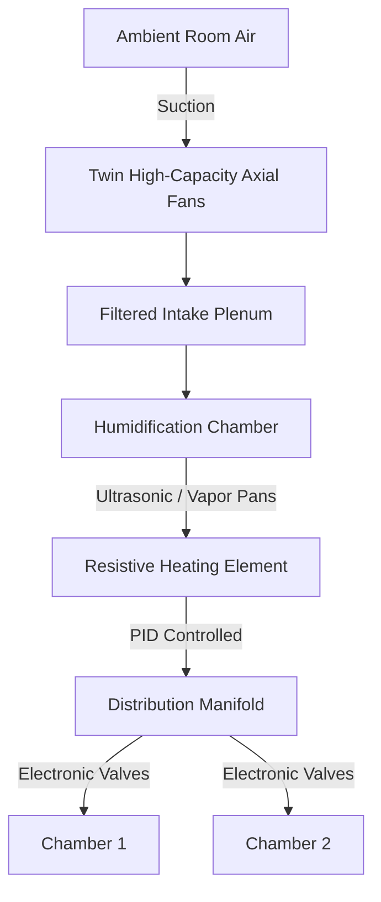
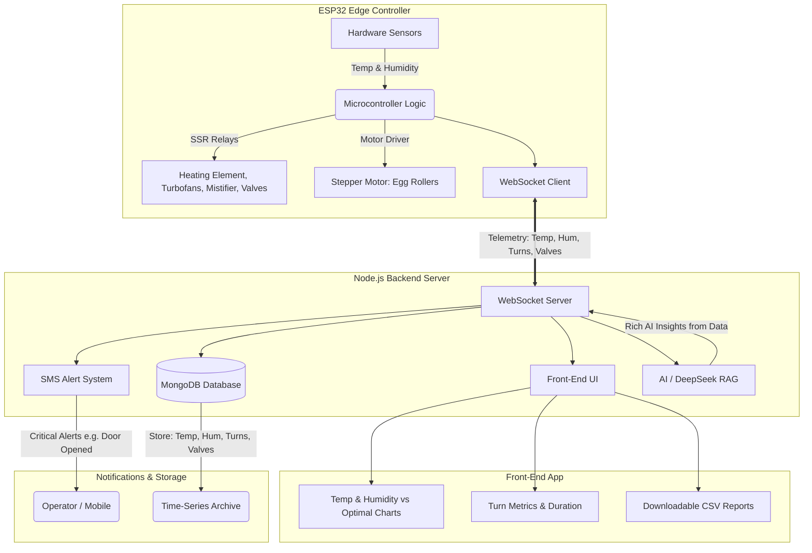

# Technical Explainer: End-Wall Cabinet Incubator System (v4.0 Pro)

This document outlines the real-world engineering principles, mechanical design, fluid dynamics, and data architecture behind the End-Wall Cabinet Incubator (v4.0 Pro). The system is designed to provide a highly controlled, biosecure, and thermodynamically stable environment for large-scale egg incubation.

## Core Project Objectives & Competitive Differentiation

The v4.0 Pro is engineered to solve the most significant logistical and biological challenges in large-scale incubation. The project is driven by five core objectives:

1. **True Dual-Zone Autonomy for Continuous Batching (Primary Objective)**
   Conventional incubators often require "all-in, all-out" loading, which disrupts production pipelines and exposes the entire batch to shared risks. The v4.0 Pro features complete thermodynamic and biosecure isolation between independent compartments. This is the project's most realistic and impactful differentiator, enabling staggered multi-stage incubation, biosecurity isolation between batches, and energy proportionality when running partial loads.
   * *Note on Compartmentalization:* The design was intentionally scaled from a 3-compartment prototype down to 2 compartments. This decision reduced the total build cost by approximately 4,000 KES while perfectly preserving the ability to demonstrate and validate the core objective of continuous batching.

2. **Centralized Heating Integration**
   Design and implement a centralized thermal core that processes all intake air prior to distribution, ensuring optimal thermal uniformity and rapid heat transfer across the entire system.

3. **Flow Optimization via CFD**
   Develop a forced-draft airflow system explicitly guided by Computational Fluid Dynamics (CFD). The goal is to aggressively eliminate all static "dead zones" using high-velocity, pulsatile pressure waves.

4. **Smart Control & IoT Autonomy**
   Implement PID (Proportional-Integral-Derivative) controllers operating in tandem with IoT telemetry systems to establish completely autonomous regulation and stability of the internal thermodynamic state.

5. **Modularity and Scalability**
   Fabricate the physical chassis and sensor arrays as standardized, interchangeable modules to permit easy scaling and rapid maintenance turnarounds for larger commercial deployments.

## 1. System Architecture & Physical Enclosure

In real-world applications, temperature and humidity stability are paramount for hatch rates. The physical chassis is engineered to minimize environmental fluctuations.

| Component | Description | Engineering Purpose |
| :--- | :--- | :--- |
| **Insulated Outer Shell** | 50mm thick opaque high-density thermal insulation. | Prevents thermal bridging and isolates the internal microclimate from ambient room conditions. |
| **Dual Compartmentalization**| Two independent horizontal incubation zones. | Allows for batch processing (e.g., loading one compartment while the other is in a different stage) and prevents cross-contamination. |
| **Airtight Sealing Doors** | Pivot-hinged glass doors with heavy-duty gaskets. | Maintains internal pressure seal; opening breaks the microclimate and disrupts designed airflow paths. |

## 2. Air Handling Unit (AHU) & Environmental Conditioning

The system utilizes an external, end-wall mounted Air Handling Unit (AHU) to process air before it enters the incubation chambers. This acts as the "lungs" of the incubator.

* **Intake & Suction:** Twin high-capacity axial fans draw in ambient air through a filtered intake plenum.
* **Active Humidification:** Air passes through a humidification chamber using either ultrasonic atomizers or heated vapor pans to inject precise amounts of moisture into the air stream, crucial for eggshell porosity and embryo development.
* **Thermal Regulation:** The air flows over a resistive heating element. A PID (Proportional-Integral-Derivative) controller pulses the heater to ensure the air reaches the exact target temperature (typically ~37.5°C / 99.5°F) without overshooting.
* **Distribution Manifold & Valves:** Fully conditioned (warm and humid) air is pushed into a vertical distribution manifold. Electronically controlled valves dictate how much air is diverted into each specific compartment, ensuring balanced pressure across both zones.

## 3. Internal Aerodynamics & Fluid Dynamics (CFD)

The core innovation of this incubator is its internal airflow management, designed to eliminate dead zones and ensure every single egg experiences identical environmental conditions.

| Aerodynamic Phase | Location | Description |
| :--- | :--- | :--- |
| **1. Laminar Inlet Jets** | High-Velocity Nozzles | Conditioned air is injected into the compartments as a smooth, parallel flow, penetrating deep into the chamber. |
| **2. Pulsatile Pressure Waves** | Chamber Atmosphere | Fan speeds are modulated to create traveling pressure fronts, breaking up stagnant pockets and ensuring robust heat transfer to the eggs. |
| **3. Recirculation Vortices** | Chamber Walls | The high-velocity jet creates shear layers against static air, naturally forming vortices that thoroughly mix the chamber air. |
| **4. Boundary Layer Penetration** | Egg Surface | Engineered flow velocity overcomes the friction drag (boundary layer) directly on the eggshells to effectively exchange heat and moisture. |
| **5. Exhaust Stream Convergence** | Exhaust Manifold | A negative pressure zone pulls depleted, CO2-rich air out, accelerating it into the exhaust spine where it is ejected by rear fans. |

* **Laminar Inlet Jets:** Conditioned air is injected into the compartments via high-velocity nozzles at the end-wall as a laminar jet, penetrating deep into the chamber.
* **Pulsatile Pressure Waves:** The system modulates fan speeds to create traveling pressure waves. These pressure fronts force the air to physically bunch up and stretch out, breaking up stagnant pockets and ensuring robust heat transfer to the eggs.
* **Recirculation Vortices & Turbulence:** The high-velocity jet creates shear layers against static air, naturally forming recirculation vortices along the sides. This controlled turbulence thoroughly mixes the air, preventing hot or cold spots.
* **Boundary Layer Friction:** As air flows over the eggs and floor, it experiences drag. The flow is engineered to have enough velocity to penetrate the boundary layer (slow-moving air directly against the eggs) to effectively exchange heat and moisture.
* **Exhaust Stream Convergence:** At the far end, a negative pressure manifold pulls the depleted, CO2-rich air out of the chamber. The air accelerates into exhaust ports, is drawn up the exhaust spine, and ejected by rear fans.

## 4. Mechanical Incubation Systems

*(Reserved for the egg tilting and turning mechanism documentation, which is crucial for preventing embryo adhesion to the shell membrane.)*

## 5. Software Architecture & Data Flow

The system's control and intelligence layer leverages a modern, distributed software architecture, enabling real-time actuation, comprehensive data visualization, and predictive analysis.

### Detailed Component Breakdown

* **ESP32 Code (Edge Controller):**
  * **Variables Controlled:** Temperature and Humidity.
  * **Hardware Interfacing:** 
    * **Sensors:** Dedicated temperature and humidity sensors provide real-time environmental input.
    * **Actuators (SSR Relay):** Controls the high-power components including the heating element, turbofans, mistifier, and mechanical valves.
    * **Actuators (Motor Driver):** Drives the stepper motor responsible for the mechanical egg tilting rollers.
  * **Network:** Continuously runs a WebSocket client for real-time telemetry streaming and command reception.

* **Node.js Server (Backend Core):**
  * **WebSocket Server:** Maintains the connection with the ESP32, receiving live state updates regarding temperature, humidity, tilting operations, and valve statuses.
  * **MongoDB Database:** Persistently stores the incoming telemetry, keeping historical logs of temp, humidity, tilts, and valve states for batch record-keeping.
  * **Front-End UI:** Serves the user-facing web dashboard, which displays:
    * Real-time temperature and humidity charts, visually mapped against optimal baseline curves.
    * Operational metrics, specifically tracking the number of successful egg tilts and their duration.
    * A data export feature offering downloadable CSV files containing tabular batch details.
  * **SMS Alert System:** Acts as an anomaly watcher; if a critical event occurs (e.g., "someone opens the door", breaking the thermal seal), it instantly dispatches SMS alerts to system operators.
  * **AI Engine:** Leverages DeepSeek RAG (Retrieval-Augmented Generation) trained on the historical database to produce rich analytical results, predicting outcomes and suggesting environmental tweaks.

## 6. Real-World Operational Summary

When powered on, the system establishes a steady-state flow loop:
1. Ambient air is drawn in, precisely heated, and humidified.
2. The conditioned air is forcefully injected into the sealed compartments.
3. Air travels in turbulent, pulsing waves, tumbling over the slowly rotating eggs to deliver oxygen and heat.
4. Carbon-dioxide-rich air is pulled through the exhaust manifold and expelled.
5. The ESP32 sensors continuously stream telemetry via WebSockets to the Node.js backend.
6. The PID controllers and AI-driven insights continuously adjust the heater, humidifiers, and fans to maintain perfect thermodynamic equilibrium.

## 7. Project Cost Breakdown

The following table details the estimated cost of the physical components and materials required to construct the v4.0 Pro incubator system (prices in Kenyan Shillings - KES):

| Item Description | Quantity | Unit Price (KES) | Total Price (KES) |
| :--- | :--- | :--- | :--- |
| Table Fans | 4 | 500 | 2,000 |
| Plumbing (1/2" Pipes) | 1 | 400 | 400 |
| Ultrasonic Mistifier | 1 | 850 | 850 |
| Nichrome Wire | 1 | 500 | 500 |
| Relay (SSR) | 1 | 1,000 | 1,000 |
| Stepper Motors | 2 | 600 | 1,200 |
| Stepper Drivers | 2 | 400 | 800 |
| ESP32 Microcontroller | 1 | 1,500 | 1,500 |
| Wiring & Soldering Kit | 1 | 500 | 500 |
| Wooden Structure Materials | 1 | 2,000 | 2,000 |
| Solenoid Valves | 4 | 1,000 | 4,000 |
| **Grand Total** | | | **14,750** |

## 8. Project Progress Report & Upcoming Milestones

As of the current development phase, significant milestones have been achieved spanning both software architecture and hardware validation.

### Completed Milestones

#### 1. Software Stack (Production-Ready)
* **Backend Stability:** The Node.js server, WebSocket implementation, and MongoDB integration are fully written and operational. Telemetry routing and database logging are functioning as designed.
* **Frontend Dashboard:** The React/Next.js UI is complete. Real-time charting (Temperature/Humidity vs Optimal), operational metric displays (tilt duration and counts), CSV downloading, and the general operator interface are fully responsive and actively subscribing to the WebSocket streams.

#### 2. Hardware Sourcing & Initial Prototyping
* All core electronic components, including the ESP32, Stepper Motors/Drivers, SSR Relays, Actuators (turbofans, mistifiers, solenoid valves), and Sensors have been successfully sourced.
* The Air Handling Unit (AHU) piping and core plumbing logic have been assembled and prepared for final mounting.

#### 3. ESP32 Hardware-in-the-Loop Testing
The C++ firmware for the ESP32 has undergone targeted unit testing on the physical hardware before full system integration:
* **Sensor Integration:** Validated accurate temperature and humidity polling with proper de-bouncing.
* **Actuator Control via SSR:** Successfully switched the heavy loads (heating elements and fans) using the Solid State Relays without logic-level interference or brownouts on the microcontroller.
* **Motor Driver Calibration:** Tested the stepper motors mapped to the egg tilting mechanism, ensuring precise micro-stepping and adequate torque to rotate a fully loaded rack.
* **Network Resilience:** Verified the WebSocket client's ability to maintain a persistent connection with the Node.js server, including simulated reconnect routines after intentional WiFi dropouts.

### Next Steps (Immediate Action Items)

1. **Chassis Fabrication & Compartmentalization:** Finalize the construction of the dual-zone wooden structure and install the 50mm high-density thermal insulation.
2. **Component Installation:** Mount the ESP32 control board, wire the high-voltage SSR banks, and route all sensor/actuator cabling into the respective compartments.
3. **AHU Integration:** Physically attach the pre-assembled Air Handling Unit piping and solenoid distribution manifold to the main chassis end-wall.
4. **Full System Burn-in Test:** Run the completed assembly (without live eggs) for a continuous 72-hour period to validate thermal stabilization, humidity control, and the AI/DeepSeek telemetry feedback loop.

